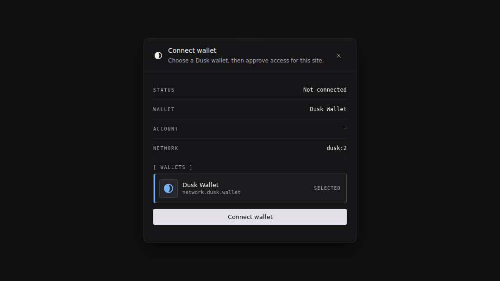

# Dusk Connect (dApp integration)



A tiny, framework-agnostic SDK for **Dusk wallet discovery + dApp integration**.

- **Lightweight** (the root entrypoint loads no cryptography)
- **Typed** (TypeScript types for the provider + RPC methods)
- Includes an **optional connect modal** (conceptually similar to a very small Reown/AppKit)
- Includes an optional **connect button** (`<dusk-connect-button />`) for drop-in UI

Canonical v0.1 docs:

- Provider API: [dusk-network/wallet docs/provider-api.md](https://github.com/dusk-network/wallet/blob/main/docs/provider-api.md)
- Discovery protocol: [docs/wallet-discovery.md](./docs/wallet-discovery.md)
- Connect SDK usage: this README
- Wallet implementer guidance: [docs/wallet-implementer.md](./docs/wallet-implementer.md)
- Security/threat model: [dusk-network/wallet docs/SECURITY.md](https://github.com/dusk-network/wallet/blob/main/docs/SECURITY.md)
- v0.1 release checklist: [docs/RELEASE_CHECKLIST_v0.1.md](./docs/RELEASE_CHECKLIST_v0.1.md)

Wallet discovery is **event-based**, not singleton-based:

- dApps listen for `dusk:announceProvider`
- dApps request discovery via `dusk:requestProvider`
- wallets expose an EIP-1193-like provider object through those events

- `dusk_getCapabilities`
- `dusk_requestProfiles`
- `dusk_profiles`
- `dusk_requestShieldedAddress`
- `dusk_chainId`
- `dusk_switchNetwork`
- `dusk_getPublicBalance`
- `dusk_estimateGas`
- `dusk_sendTransaction`
- `dusk_watchAsset`
- `dusk_signMessage`
- `dusk_signAuth`
- `dusk_disconnect`

## Provider integration notes

- Discovery UUIDs identify provider instances on the current page, not products.
  Explicit selections now persist a versioned `rdns` product hint; restoration
  requires a unique match. Old raw-ID preferences still work when that ID is
  present, and migrate on the next explicit selection. `preferredProviderId`
  and `selectProvider(uuid)` remain current-page selectors. An unmatched saved
  preference or `preferredProviderId` leaves selection empty until a match
  arrives or the user explicitly selects another instance. Constructor-supplied
  providers are explicit choices, not restored product hints.
- Discovery keeps the first valid provider object and metadata received for each
  UUID, ignoring later duplicates even from the same object. Duplicate claims
  neither replace nor disable that entry, before or after selection. Later
  announcements also do not clear an active selection. This follows MIPD-style
  first-wins handling, not wallet authentication: the first claimant can be
  forged, and UUIDs and `rdns` remain self-attested. The modal keeps its
  self-reporting notice; the legacy `conflicted` field is deprecated and never
  set. See the [discovery rules](./docs/wallet-discovery.md#selection-rules).
- Chain IDs are CAIP-2 strings such as `dusk:2`, not bare decimal or
  hexadecimal numbers. Parse the numeric component with
  `/^dusk:(\d+)$/i.exec(chainId.trim())` only when a numeric protocol value is
  required.
- `wallet.signMessage()` and `wallet.signAuth()` request domain-separated
  Moonlight memo signatures from the selected provider. They do not produce a
  raw BLS short-signature over caller bytes and cannot verify against a raw
  contract digest. See the
  [wallet provider documentation](https://github.com/dusk-network/wallet/blob/main/docs/provider-api.md#dusk_signmessage)
  and [wallet issue #90](https://github.com/dusk-network/wallet/issues/90).
- A connected profile's Base58 `account` is its 96-byte compressed Moonlight
  public key. Use `accountToHex(account)` for contract-ready `0x` hex and
  `hexToAccount(publicKey)` for the reverse conversion; neither requires
  another wallet permission.
- `wallet.sendContractCall()` accepts the documented `ByteLike` inputs and
  normalizes `fnArgs` to `0x`-hex before crossing the extension provider
  boundary. Site-provided `display` metadata is unverified approval context;
  contract IDs, amounts, and opaque arguments still require user verification.

## Vanilla demo

A no-bundler demo lives at `examples/vanilla/` and imports the SDK directly from `dist/`.
From a fresh checkout, build the SDK once before serving the repo locally:

```bash
npm ci
npm run build
python3 -m http.server 5173
```

Then open `http://localhost:5173/examples/vanilla/`.

A mock multi-wallet discovery demo lives at `examples/discovery-demo/` and is useful when you want to inspect provider selection behavior without installing multiple wallets.
A wallet-author reference page lives at `examples/reference-wallet/` and is useful when
you want to see the smallest useful injected-wallet implementation talking to
`createDuskWallet()`.

All example pages in `examples/` load the built SDK from `dist/`, so the same
`npm run build` step applies before serving any of them from the repository.

## Discovery demo

An isolated discovery reference page lives at `examples/discovery-demo/`.

Open it via:

- `http://localhost:5173/examples/discovery-demo/`

This demo shows:

- how wallets announce themselves with `dusk:announceProvider`
- how a dApp re-requests discovery with `dusk:requestProvider`
- how explicit provider selection works when more than one wallet is available

## Wallet implementer reference

If you're building a wallet instead of a dApp:

- read [docs/wallet-implementer.md](./docs/wallet-implementer.md)
- open `http://localhost:5173/examples/reference-wallet/`

The reference page shows a minimal wallet injection built on the raw browser
events and a dApp consuming it through `createDuskWallet()`.
If you want to test a wallet implementation from another repository, use
`@dusk/connect/testing` from a jsdom test as described in
[`docs/wallet-implementer.md`](./docs/wallet-implementer.md).

## Dario FSM demo

A small **on-chain game UI** for the `dario_fsm_contract` lives at `examples/dario-fsm/`.

Open it via:

- `http://localhost:5173/examples/dario-fsm/`

This demo shows:

- how to use a compiled **data-driver** (`data_driver.wasm`) to encode/decode contract calls (locally)
- how to read contract state using **read-only calls**:
  - `current_state() -> u32`
  - `revive_count() -> u32`
- how to submit a `contract_call` transaction:
  - `handle_event(u32)` (Espresso / Chili / Cape / Damage / Revive)

The UI is intentionally minimal: a stage, a HUD (state + revives), and context-aware actions.

## Schema explorer demo

An isolated **contract schema explorer** lives at `examples/schema-explorer/`.

Open it via:

- `http://localhost:5173/examples/schema-explorer/`

This demo focuses on inspecting a data-driver schema and invoking methods based on the schema metadata.

## Install

Published package:

```bash
npx jsr add @dusk/connect
# or, in Deno:
deno add jsr:@dusk/connect
```

```ts
import { createDuskWallet } from "@dusk/connect";
```

Optional entrypoints:

```ts
import { runWalletConformance } from "@dusk/connect/testing";
import { defineDuskConnectButton } from "@dusk/connect/ui";
import { hashTypedDataHex } from "@dusk/connect/typed-data";
import { verifyTypedDataSignature } from "@dusk/connect/bls";
```

The unreleased `./typed-data` and `./bls` entrypoints use
[`@dusk/typed-data`](https://github.com/dusk-network/typed-data). The root entrypoint
loads no cryptography. This integration pins the published JSR
`@dusk/typed-data@0.1.0-rc.0` release through its npm compatibility registry;
no native npm publication of the library is required.

`npx jsr add` configures the JSR registry for npm projects. When installing a packed
Connect build manually in another npm project, configure that scope first:

```sh
npm config set @jsr:registry=https://npm.jsr.io --location=project
```

This checkout already includes that `.npmrc` setting and a registry-backed lockfile;
use `npm ci` to reproduce it. The protocol remains draft, not frozen.

Verification requires trusted chain/origin expectations and an explicit `result.ok`
check. Given the original typed input and the Wallet response:

```ts
const result = verifyTypedDataSignature(
  { ...input, origin: response.origin },
  response.signature,
  response.publicKeyHex,
  { chainId: "dusk:2", origin: "https://app.example" },
);
if (!result.ok) throw new Error(result.code);
```

The response supplies the origin Wallet signed; the policy supplies the origin the
application expects. Applications must also check the signer, authorization and
replay protection. `verifyBlsDigest` is not a typed-data verifier. See the
[typed-data specification and usage](./docs/typed-data-v1.md).

## Which entrypoint should I use?

### `createDuskWallet()` / `DuskWallet`

Use this when you only need wallet discovery + provider access:

- connect / disconnect
- read profiles + chain
- get balances
- send transactions

It’s the smallest surface area and does not create contract facades, node clients, or data-drivers.

```ts
import { createDuskWallet } from "@dusk/connect";

const wallet = createDuskWallet();
await wallet.ready();

if (!wallet.provider) {
  // Use your picker or the optional Connect modal, not the first list entry.
  throw new Error("Select a wallet first");
}

await wallet.connect();
console.log(wallet.state.profiles);

// Request the selected profile's public account + shielded receive address in one approval.
await wallet.connect({ shieldedReceiveAddress: true, reason: "payment_request" });
console.log(wallet.state.selectedProfile);
```

Non-interactive provider reads (`dusk_getCapabilities`, `dusk_chainId`,
`dusk_profiles`, `dusk_getPublicBalance`, `dusk_estimateGas`) have a 10-second
per-request deadline. Configure `createDuskWallet({ providerReadTimeoutMs: 20_000 })`
with an integer from 1 through 2,147,483,647 milliseconds. A timeout rejects with
`DuskWalletRequestTimeoutError` (a `DuskSdkError`) and `data: { method, timeoutMs }`;
it does not invent a provider RPC error code. Initial read timeouts reject
`ready()` too; catch that error and offer `wallet.refresh()` to retry. `ready()`
records the initial attempt, not the retry. Read-only `wallet.initializing` is
`true` only while that initial discovery/refresh is pending, and becomes `false`
after either success or failure; it does not indicate authorization or recovery.
Contract writes and chain checks do not replay a settled startup error. After a
successful `refresh()`, a write can proceed even without an advertised node;
its handle still refuses automatic tracking when the submission node is unknown.
Other unsupported/failed initialization reads retain their best-effort fallback behavior.

The deadline does **not** cancel the provider operation, and late read responses
do not update the wrapper state. Connect does not apply this deadline to approvals,
signing, transactions, disconnection, or unknown methods. A provider is executable
page code: timers do not sandbox it or interrupt synchronous JavaScript.

### `createDuskApp()`

Use this when you’re building a **smart contract dApp** and you want one object that wires together:

- a `DuskWallet` instance (`dusk.wallet`)
- a node client for **read-only contract calls**
- a WASM **data-driver** loader/cache
- ergonomic helpers inspired by Viem/Wagmi:
  - `readContract()`
  - `prepareContractCall()`
  - `writeContract()`

```ts
import { createDuskApp, DUSK_CHAIN_PRESETS } from "@dusk/connect";

const dusk = createDuskApp({
  nodeUrl: "https://testnet.nodes.dusk.network",
  chain: { chainId: DUSK_CHAIN_PRESETS.testnet },
});

await dusk.ready();

// dApps/UI components still use the same wallet instance
await dusk.wallet.connect();
```

`nodeUrl` remains a **fallback**, not a pin: a valid wallet-advertised URL takes
precedence. To keep app reads on a trusted node, use
`createDuskApp({ pinnedNodeUrl: "https://my-node.example" })`. `pinnedNodeUrl` wins
over both `nodeUrl` and provider updates, but does not switch or pin the wallet's
transaction network. Set/check the write `chain` separately. A transaction handle
refuses automatic tracking when its wallet-reported submission node differs from
the read node rather than silently following it.

Node URLs must be absolute HTTPS, or HTTP on `localhost`, IPv4 loopback (127/8)
or `[::1]`, without credentials, query or fragment. They are serialized with the
native URL parser and stripped of trailing slashes before use, so scheme-like
inputs cannot become page-relative fetches. For node URL targets, `ensureChain`
uses the same URL policy and normalization; its `strictNodeUrl` option instead requires the input string to
match the normalized wallet snapshot exactly. Invalid provider URLs clear
the node snapshot and app reads use their fallback; invalid app-configured URLs
throw at construction. The node transport checks the policy again before I/O.
This is URL validation, **not** node authentication, an IP/DNS/redirect allowlist
or general SSRF protection. HTTPS alone does not make a provider-selected node
trustworthy. `connect` events trigger a reread of the provider rather than granting
permission from their payload; provider authorization and capability claims remain
self-reported.

Tip: you can share a wallet instance between both APIs:

```ts
const wallet = createDuskWallet();
const dusk = createDuskApp({ wallet, nodeUrl: "https://testnet.nodes.dusk.network" });
```

## Quick start (core)

```ts
import {
  createDuskWallet,
  parseDuskToLux,
  formatLuxShort,
  ERROR_CODES,
} from "@dusk/connect";

const wallet = createDuskWallet();
await wallet.ready();

// Optional: reactively track wallet state
wallet.subscribe((state) => {
  console.log("wallet state", state);
});

if (!wallet.state.installed) {
  // show "Install Dusk Wallet" UI
}

if (!wallet.provider) {
  // Show a picker, then pass the user's chosen UUID to wallet.selectProvider().
  throw new Error("Select a wallet first");
}

// Prompt connection (opens wallet approval)
try {
  const profiles = await wallet.connect();
  console.log("Connected profile", profiles[0]);
} catch (err: any) {
  if (err?.code === ERROR_CODES.USER_REJECTED) {
    console.log("user rejected");
  }
}

// Read balance
const bal = await wallet.getPublicBalance();
console.log("Balance", formatLuxShort(bal.value), "DUSK");

// Shielded receive addresses are profile-scoped. This prompts for a profile
// pair instead of exposing a loose wallet-level address.
await wallet.connect({ shieldedReceiveAddress: true, reason: "payment_request" });
console.log("Selected profile", wallet.state.selectedProfile);

// Send a transfer
await wallet.sendTransfer({
  privacy: "public",
  to: "<base58-account-id>",
  amount: parseDuskToLux("1.5"), // 1.5 DUSK -> Lux string
  memo: "hello",
});
```

## Contract call

```ts
import { createDuskWallet } from "@dusk/connect";

const wallet = createDuskWallet();
await wallet.connect();

const tx = await wallet.sendContractCall({
  privacy: "public",
  contractId: "0x" + "02".padEnd(64, "0"), // 32 bytes
  fnName: "get_version",
  // Connect accepts ByteLike here and sends transport-safe 0x-hex to the wallet.
  fnArgs: new Uint8Array(),
  // Shown as site-provided, unverified approval context.
  display: { label: "Read contract version" },
});

console.log("tx", tx.hash);
```

## Quick start (dApp app + contracts)

If you want a **single entrypoint** for contract developers:

- wallet state + connect/disconnect
- node contract calls (read-only)
- data-driver loading (WASM)
- simple helpers inspired by **Viem/Wagmi** (`readContract / prepareContractCall / writeContract`)
- an optional proxy facade (`dusk.contract("...")`)

use `createDuskApp()`.

```ts
import { createDuskApp, DUSK_CHAIN_PRESETS, parseDuskToLux } from "@dusk/connect";
import { defineDuskConnectButton } from "@dusk/connect/ui";

defineDuskConnectButton();

const dusk = createDuskApp({
  // for read calls (fallback when wallet hasn't provided a node yet)
  nodeUrl: "https://testnet.nodes.dusk.network",

  // enforced before contract writes
  chain: { chainId: DUSK_CHAIN_PRESETS.testnet },

  autoConnect: true,

  // Optional presets so you can do dusk.contract("dario")
  contracts: {
    dario: {
      contractId: "0x<YOUR_CONTRACT_ID>",
      driverUrl: "/data_driver.wasm",
      name: "Dario FSM",
      methodSigs: {
        current_state: "current_state()",
        revive_count: "revive_count()",
        handle_event: "handle_event(u32)",
      },
    },
  },
});

await dusk.ready();

// Wire the connect button to the same wallet instance
document.querySelector("dusk-connect-button")!.wallet = dusk.wallet;

// Read-only calls (node executes, driver decodes locally)
const state = await dusk.readContract({ contract: "dario", functionName: "current_state" });
const revives = await dusk.readContract({ contract: "dario", functionName: "revive_count" });

// Build tx params (for previews / custom flows)
const params = await dusk.prepareContractCall({
  contract: "dario",
  functionName: "handle_event",
  args: 0,
  amount: parseDuskToLux("0"),
  deposit: parseDuskToLux("0"),
});
console.log("contract_call params", params);

// Send (auto-connects + ensures chain)
const tx = await dusk.writeContract({
  contract: "dario",
  functionName: "handle_event",
  args: 0,
  amount: parseDuskToLux("0"),
  deposit: parseDuskToLux("0"),
});
console.log("tx hash", tx.hash);

// Optional: subscribe to status updates (submitted -> executed/failed/timeout)
const unsubscribe = tx.onStatus((u) => {
  console.log("tx status", u.status);
  if (u.status === "failed" || u.status === "timeout") {
    console.warn("tx error", u.receipt?.error);
  }
});

// Optional: wait for execution (RUES event stream)
const receipt = await tx.wait({ timeoutMs: 60_000 });
console.log("executed?", receipt.ok, receipt.status, receipt.error);

unsubscribe();

// Optional: proxy facade (w3sper-ish)
// const dario = dusk.contract("dario");
// const st = await dario.call.current_state();
```

## Switch network / chain

The wallet will show a user approval prompt.
Chain IDs use CAIP-2 format (`dusk:<id>`).

```ts
import { createDuskWallet, DUSK_CHAIN_PRESETS } from "@dusk/connect";

const wallet = createDuskWallet();
await wallet.connect();

// Prefer preset chain ids (mainnet/testnet/devnet/local)
await wallet.switchChain({ chainId: DUSK_CHAIN_PRESETS.testnet });

// ...or switch to a custom node
await wallet.switchChain({ nodeUrl: "https://my.custom.node:9000" });
```

## Ensure chain (optional helper)

If your dApp *requires* a specific chain, you can use the small helper `ensureChain()`.
It checks the current chain and only calls `switchChain()` when a change is actually needed.

It returns:

- `true` if it initiated a switch (i.e. the wallet will show an approval prompt)
- `false` if you were already on the desired chain

```ts
import {
  createDuskWallet,
  ensureChain,
  DUSK_CHAIN_PRESETS,
} from "@dusk/connect";

const wallet = createDuskWallet();
await wallet.connect();

// Ensure Testnet (only prompts if not already on testnet)
await ensureChain(wallet, { chainId: DUSK_CHAIN_PRESETS.testnet });

// Ensure a custom node (best-effort: compares against the wallet-emitted nodeUrl when available)
await ensureChain(wallet, { nodeUrl: "https://my.custom.node:9000" });

// If you really want to enforce the exact nodeUrl string (when available):
await ensureChain(wallet, { nodeUrl: "https://my.custom.node:9000" }, { strictNodeUrl: true });
```

## Optional connect modal (UI)

If you want a quick, drop-in "connect" flow (Reown/AppKit-style, but tiny):

```ts
import { createDuskConnectKit } from "@dusk/connect/ui";

const kit = createDuskConnectKit({
  modal: {
    appName: "My dApp",
  },
});

document.getElementById("connect")!.addEventListener("click", () => {
  kit.open();
});

// You can still use the full SDK via kit.wallet
kit.subscribe((state) => console.log(state));
```

When no compatible wallet is detected, the modal shows curated install options
for the user's browser: Dusk Wallet and Piewallet on Chromium browsers, and
Dusk Wallet on Firefox.

## WalletConnect-style connect button (UI)

If you want the common “Connect Wallet” button UX, the SDK ships a small web component:

```html
<dusk-connect-button
  app-name="My dApp"
  variant="solid"
  theme="auto"
></dusk-connect-button>
```

Then wire it to a wallet instance (so your dApp and the button share the same state):

```ts
import { createDuskWallet } from "@dusk/connect";
import { defineDuskConnectButton } from "@dusk/connect/ui";

defineDuskConnectButton();

const wallet = createDuskWallet();
await wallet.ready();

const btn = document.querySelector("dusk-connect-button");
if (btn) btn.wallet = wallet;
```

The button opens the same connect modal on click.

It emits a single DOM event (bubbling) to make integration easy:

- `dusk-state` (detail: full wallet state)

If you want higher-level semantics like “connected / disconnected”, compare successive `dusk-state` payloads or subscribe to `wallet.subscribe(...)`.

### Theming (UI)

The connect UI is skinnable via **CSS variables**.

The UI supports `theme="auto" | "dark" | "light"` on `<dusk-connect-button>`.
`auto` is the default and follows `prefers-color-scheme`; explicit `dark` or `light`
also applies to the owned connect modal.

All tokens are **namespaced** to avoid collisions with host dApps:

- `--dconnect-*`

You can override them globally (affects modal + button):

```css
:root {
  --dconnect-primary: #71B1FF;
  --dconnect-background: #101010;
  --dconnect-foreground: #F2F0EB;
  --dconnect-radius: 8px;
}
```

…or scope them to the button only:

```css
dusk-connect-button {
  --dconnect-primary: #71B1FF;
}
```

Commonly useful tokens:

- `--dconnect-primary`, `--dconnect-ring`, `--dconnect-destructive`
- `--dconnect-background`, `--dconnect-foreground`, `--dconnect-border`
- `--dconnect-radius-sm`, `--dconnect-radius`, `--dconnect-radius-lg`, `--dconnect-shadow`
- `--dconnect-font-sans`, `--dconnect-font-mono`


## Script tag (ES module)

You can use the compiled ESM build directly in a browser with `type="module"`.

Example (served from your own site):

```html
<script type="module">
  import { createDuskWallet, parseDuskToLux } from "./dist/index.js";

  const wallet = createDuskWallet();
  await wallet.ready();

  if (!wallet.state.installed) {
    console.log("Dusk Wallet not installed");
  } else {
    await wallet.connect();
    await wallet.sendTransfer({
      privacy: "public",
      to: "<base58-public-account-id>",
      amount: parseDuskToLux("1"),
    });
  }
</script>
```

## Build

```bash
npm run build
```

Produces ESM + types in `dist/`.
`npm pack` and `npm publish` run this automatically via `prepack`.
`npm run test:package` also checks packed entrypoint files and imports the built
package through its public exports; it is included in `npm run ci`.

## Publishing

The package is published as `@dusk/connect` on JSR.

npm publishing is intentionally separate; do not assume npm availability unless
a later npm release under an appropriate npm scope is announced.

Before publishing a release:

```bash
npm run ci
npm pack --dry-run
npx jsr publish --dry-run
```
